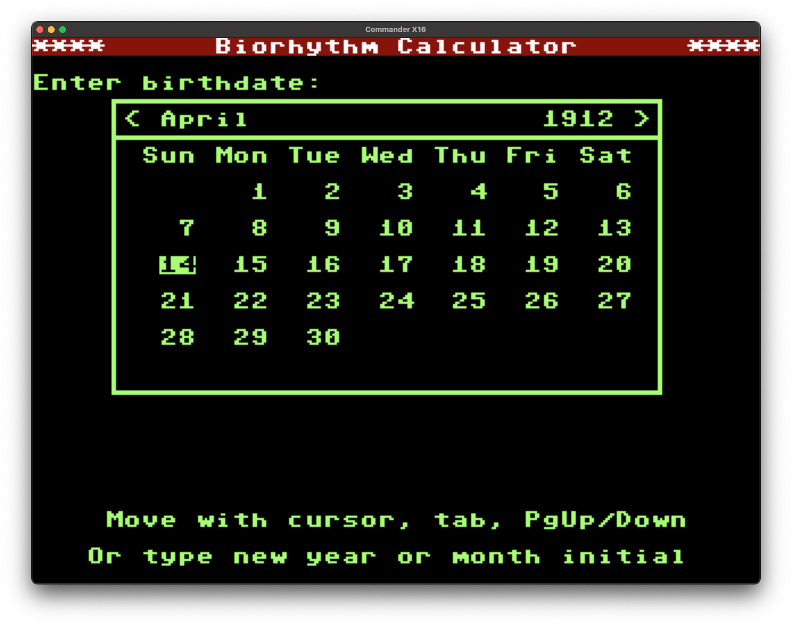

# Biorhythms calculator for the Commander X-16
#
Biorhythms were a pseudoscientific fad popular in the US in the 1970s, so
they felt like an appropriate way to put some retro into our new retro
computer. Written in [Prog8](https://prog8.readthedocs.io) to keep
the plotting of the curves reasonably fast.

The source includes a general-purpose date manipulation library.  It
stores dates as a day count from the turn of the millennium in a 16-bit word,
ranging from -32768 = April 15, 1911 to +32767 = September 17, 2090. It also
includes a TUI datepicker widget, which only works within the whole-year part
of that range, from January 1, 1912 to December 31, 2089.

The default target date is obtained from the X16's on-board real-time clock.

|File |Description|
|--------|-----------|
| README.md  | This file |
| [biorhythms.prg](biorhythms.prg) | RUNnable executable       |
| [biorhythms.p8](matrix.p8)       | Main program              |
| [datepicker.p8](datepicker.p8)   | Date picker widget        |
| [dates.p8](dates.p8)             | Date library              |
| [textbox.p8](textbox.p8)         | Text box widget           |
| [tui.p8](tui.p8)                 | Generic TUI utilities (currently just a |
|                                  | text-centering function)  |
| [Makefile](Makefile)             | Build script
