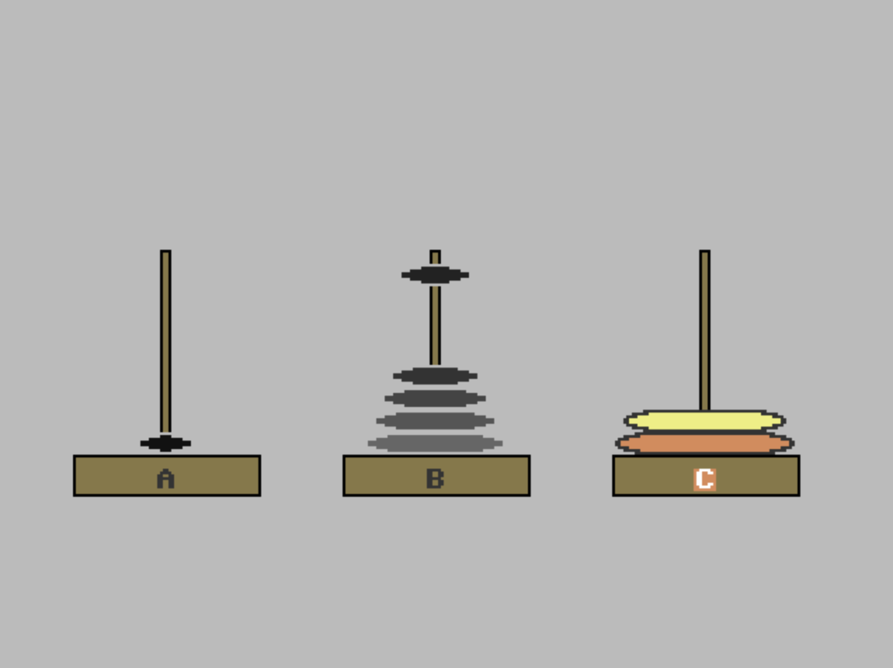

# Towers of Hanoi

This animates a solution for the 8-disc [Towers of Hanoi](https://en.wikipedia.org/wiki/Towers_of_Hanoi). It cycles continuously, moving the disks to each peg
in turn, with a brief pause in between each completed migration.

It uses a recursive solution, so can be used as an example of how to write
such things in BASIC, given its lack of general local varaibles.

|File |Description|
|--------|-----------|
| README.md  | This file |
| [hanoi.prg](hanoi.prg) | RUNnable executable |
| [hanoi.bas](hanoi.bas) | BASIC source code
