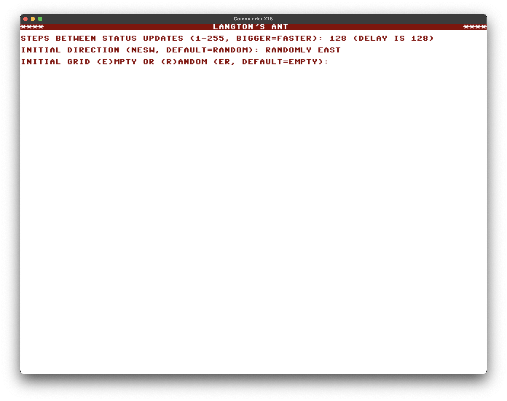
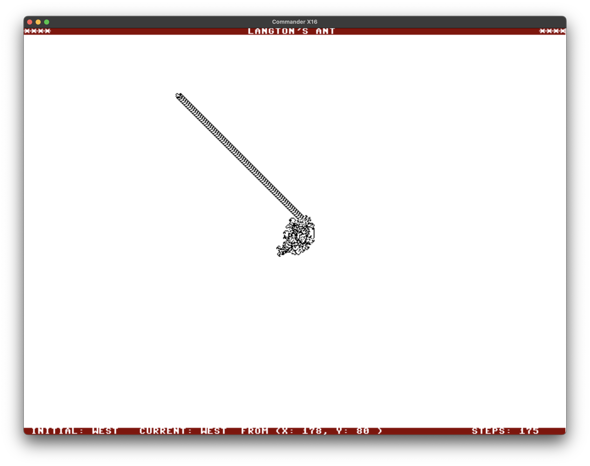

# Langton's Ant

This runs a simulation of the cellular automaton [Langton's
Ant](https://en.wikipedia.org/wiki/Langton's_Ant) using the CX16's
high-resolution 640x480 bitmap graphics mode. 

|File |Description|
|--------|-----------|
| README.md  | This file |
| [langton.prg](langton.prg) | RUNnable executable |
| [langton.p8](langton.p8)  | [Prog8](https://prog8.readthedocs.io) source code
| [Makefile](Makefile)   | Build script
