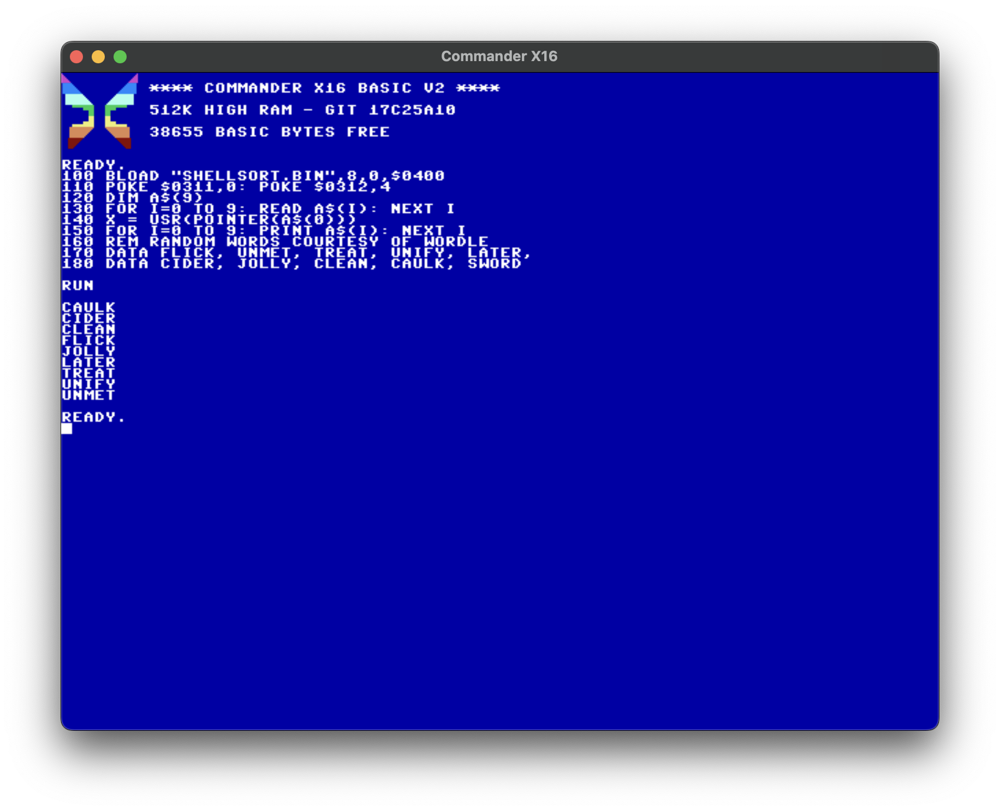

# Shell's Sort

This is a companion routine to be used from a BASIC program. Called via 
the USR() function with an argument of the address of a BASIC string array,
it wil sort that array in place using [Shell's algorithm](https://en.wikipedia.org/wiki/Shellsort).

|File |Description|
|--------|-----------|
| README.md  | This file |
| [loader.asm](loader.asm) | Assembly source for loader and function |
| [loader.prg](loader.prg) | RUNnable executable that installs the USR() function|
| [SHELLSORT.BIN](SHELLSORT.BIN)  | Assembled and BLOADable function handler
| [demo.bas](demo.bas)  | BASIC demo program
| [demo1000.bas](demo1000.bas)  | Demo on longer array (1000 words)
| [1000WORDS.TXT](1000WORDS.TXT)  | The 1000 words sorted by the demo

